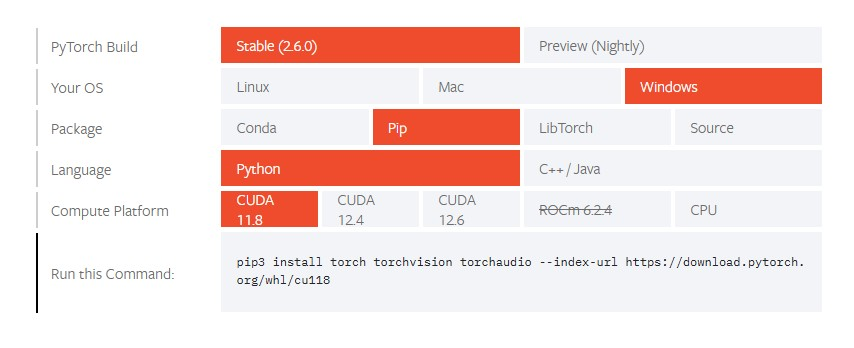
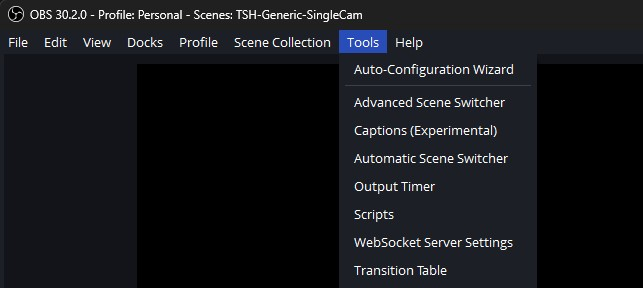
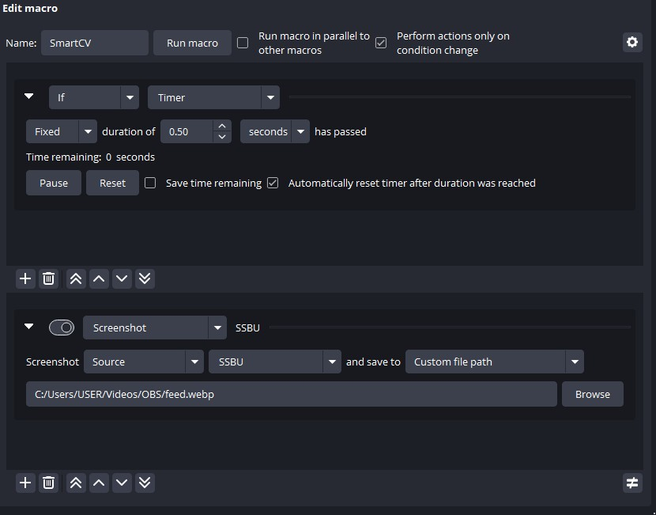

# SmartCV-SSBU

SmartCV-SSBU is a tool designed to provide data on Super Smash Bros. Ultimate matches without the need for installing mods on your Nintendo Switch, or the need for a powerful PC to read game data in real time. 

It's a project that uses pixel detection to recognize certain situations in the game to take the opportunity to read data from using OCR. Due to this, it's able to gather enough data to report the results on a match (some assumptions given). Look for the **How does it work?** section to get a more in-depth explanation.

## Requirements
- [Python (minimum version 3.11)](https://www.python.org/downloads/)
- [OBS (does not necessarily need to be streaming)](https://obsproject.com/download)
- [Advanced Scene Switcher OBS Plugin](https://github.com/WarmUpTill/SceneSwitcher/releases)
- A capture card that is able to output the game in 1080p

## Installation & Setup
- Download the compiled release [here](https://github.com/skpeter/smartcv/releases).
- Open a terminal such as `Command Prompt (cmd)` or `bash` and enter the following command:
- - `pip install easyocr`
- You will also need to install PyTorch, and the command to use depends on your system. Head to Pytorch's "Start Locally" section [here](https://pytorch.org/get-started/locally/), pick the **Stable** build, select the OS you use (**Windows, Mac or Linux**), **Pip** as packaging system, **Python** as language and then select the **Compute Platform** available on your system.

- - **Compute Platform** depends on which video card (GPU) you own. Look up your video card's specifications on your manufacturer's website and check out which of the available platforms it supports.
- - If your computer does not support any of the available platforms, you can choose **CPU** (which is going to be slower and use up more resources, but still works).
- - Choosing these options will generate a command that you should copy and paste on your terminal. PyTorch weighs around 3GB, so take your time.
- SmartCV will read from a separate feed from OBS that will be provided to it. This is where Advanced Scene Switcher comes in. Once you have it installed, open it on the Tools tab:

- On the window that opens, go to the Macros tab and click on the plus sign to add a new macro (you can name it anything you want). Click on the other plus signs to add a condition and an action to this macro. I've attached a screenshot so you can mimic the settings:

- - "SSBU" should be the Video Capture Device source that is using your capture card.
- - You can set the path to save the screenshot anywhere you'd like (SmartCV must have access to it), but it is **highly recommended** that you save the screenshot as a **WEBP**. This image format causes the least amount of issues and is very lightweight, however if for some reason you can't use WEBPs, you can save it as a JPG instead. 
- Go to SmartCV's `config.ini` file and set the `feed_path` setting to the path where OBS is saving the screenshots.

## Usage
- **All you need to do is open smartcv.exe and follow the on-screen instructions for the game detection to start. Make sure to keep OBS open!** 

## Where do I use this?
SmartCV opens a websocket server (on port 6565 by default) to send data to.
As of this writing, only [S.M.A.R.T.](https://skpeter.github.io/smart-user-guide) has integrations to it. If you want to integrate SmartCV into your own app, you can look at what the data output looks like on the example JSON files.

## Known Issues

- The app currently is unable to tell from the three different Mii fighter characters (because on the versus screen, they all show up as Mii). A solution is being worked on
- The app doesn't know how to differentiate handwarmers from actual matches. [S.M.A.R.T.](https://skpeter.github.io/smart-user-guide) (the companion app) has a workaround for this at the moment.

## How does it work?

Explanation coming soon

## Contact

[I am mostly available on my team's Discord Server if you'd like to talk about SmartCV or have any additional questions.](https://discord.gg/zecMKvF8b5)
